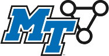

# MTSU COMS-REU Python Boot Camp

Workshop materials for the Computational and Data Science (COMS) Research Experience for Undergraduates (REU) summer program hosted at MTSU (Summer 2019, 2021, 2022).

Faculty Mentors:

* Wandi Ding
* Rachel Leander
* Joshua Phillips
* William Robertson

Project Funded by NSF Award #[1757493](https://www.nsf.gov/awardsearch/showAward?AWD_ID=1757493)

All materials copyright &copy; Middle Tennessee State University COMS-REU Faculty Mentors (unless explicitly noted otherwise on individual materials).

